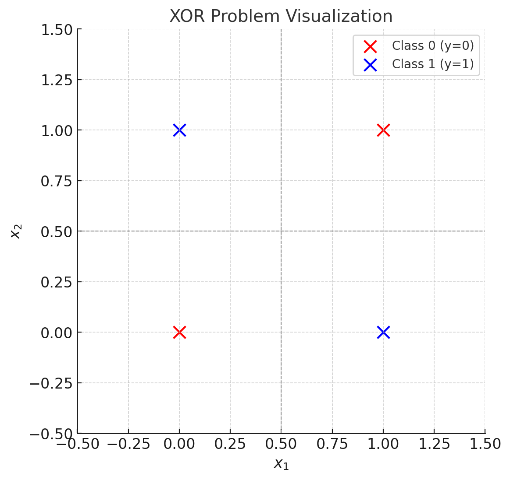

# 理论作业-1：感知机
10225501443 刘蔚璁

## Q2.1: 证明感知机不能表示异或问题

### 感知机的基本概念
以二维情况为例，感知机的模型公式为：
\[
y = \text{sign}(\mathbf{w} \cdot \mathbf{x} + b)
\]
其中：
- \(\mathbf{x} = (x_1, x_2)\) ：输入特征。
- \(\mathbf{w} = (w_1, w_2)\) ：权重向量。
- \(b\) ：偏置。
- $\text{sign}(\cdot)$：符号函数，输出为 $+1$ 或 $-1$。

感知机模型寻找的是一个线性决策边界（超平面）：
\[
w_1 x_1 + w_2 x_2 + b = 0
\]

---
### 异或问题的定义
异或逻辑门的输入和输出如下表：

| \( x_1 \) | \( x_2 \) | 输出 \( y \) |
|:---------:|:---------:|:-----------:|
| 0         | 0         | 0           |
| 0         | 1         | 1           |
| 1         | 0         | 1           |
| 1         | 1         | 0           |

**几何解释**：
- 异或问题可以看作在二维平面上的四个点：
  - (0, 0) 对应 \( y = 0 \)
  - (0, 1) 对应 \( y = 1 \)
  - (1, 0) 对应 \( y = 1 \)
  - (1, 1) 对应 \( y = 0 \)

---

### 数学证明
使用反证法证明，首先假设存在一个线性超平面 \( w_1 x_1 + w_2 x_2 + b = 0 \) 能将异或问题正确分类，其中 \( y = 1 \) 对应正类，\( y = 0 \) 对应负类，得到以下式子：
- \( w_1 \cdot 0 + w_2 \cdot 0 + b < 0 \) 
- \( w_1 \cdot 1 + w_2 \cdot 0 + b \ge 0 \) 
- \( w_1 \cdot 0 + w_2 \cdot 1 + b \ge 0 \) 
- \( w_1 \cdot 1 + w_2 \cdot 1 + b < 0 \) 

1. 从第一个和第二个式子：
    \[
    b < 0 \quad \text{且} \quad w_1 + b \ge 0
    \]
    联立可得：
    \[
    w_1 > 0
    \]

2. 从第三个和第四个式子：
   \[
   w_2 + b \ge 0 \quad \text{且} \quad w_1 + w_2 + b < 0
   \]
   联立可得：
   \[
   w_1 < 0
   \]

3. 从第一个和第三个式子：
    \[
    b < 0 \quad \text{且} \quad w_2 + b \ge 0
    \]
    联立可得：
    \[
    w_2 > 0
    \]
4. 从第二个和第四个式子：
   \[
   w_1 + b \ge 0 \quad \text{且} \quad w_1 + w_2 + b < 0
   \]
   联立可得：
   \[
   w_2 < 0
   \]

综上所述，上式对 \( w_1 \) 及 \( w_2 \) 的约束均矛盾，即无法找到满足所有条件的 \(\mathbf{w}\) 和 \(b\)使假设成立。因此，感知机不能表示异或问题。

---

### 图形直观解释
异或问题中的点分布如下：

- 类别 \(y = 0\)：(0, 0) 和 (1, 1)
- 类别 \(y = 1\)：(0, 1) 和 (1, 0)

绘制出二维平面图：

可以看到这四个点呈现交叉分布，任何一条直线都无法将 \(y = 1\) 和 \(y = 0\) 的点完全分开，因此感知机不能表示异或问题。
