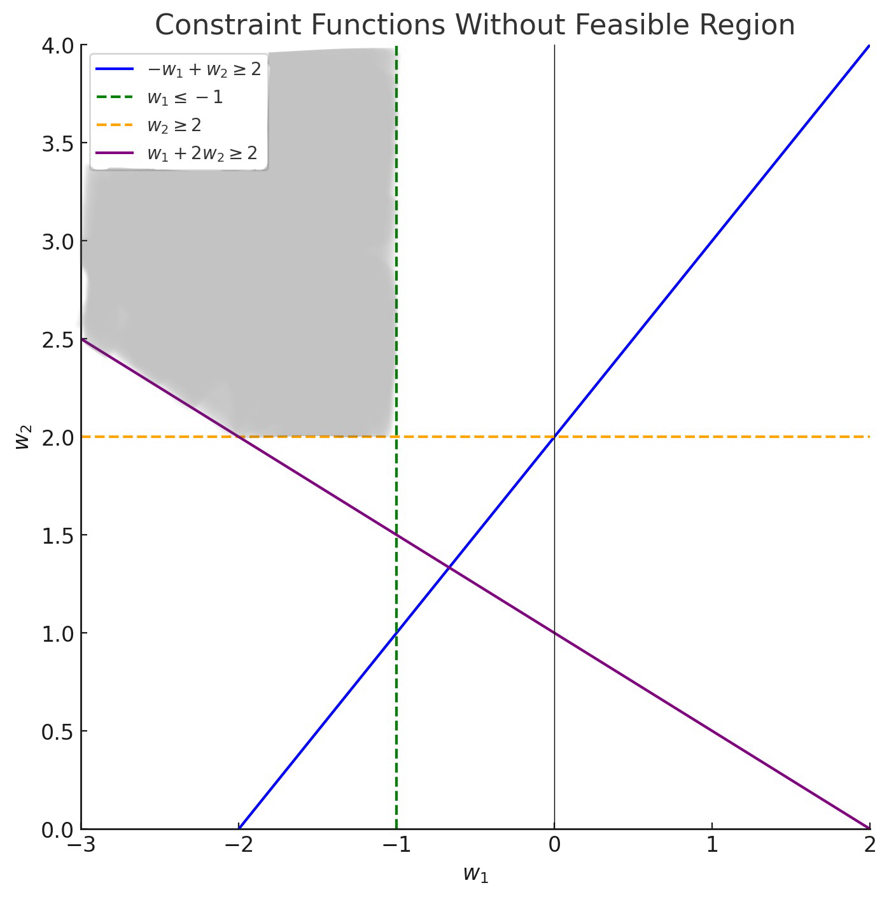

# 理论作业-3：支持向量机
10225501443 刘蔚璁

## Q1: 已知以下正例点 $x_1 = (1,2)^T, \; x_2 = (2,3)^T, \; x_3 = (3,3)^T$，负例点$x_4 = (2,1)^T, \; x_5 = (3,2)^T$，试求最大间隔分离超平面和分类决策函数并找出哪些点是支持向量。

### **1. 问题建模**

#### 已知数据点：
- **正例点：**
  $$
  x_1 = (1, 2)^T, \; x_2 = (2, 3)^T, \; x_3 = (3, 3)^T
  $$
- **负例点：**
  $$
  x_4 = (2, 1)^T, \; x_5 = (3, 2)^T
  $$

#### 超平面形式：
假设超平面方程为：
$$
f(x) = w^T x + b = 0
$$
分类决策规则为：
$$
\text{正例: } f(x) > 0 \quad \text{负例: } f(x) < 0
$$

#### 优化目标：
在支持向量机中，我们通过最大化间隔来构造最优超平面。间隔公式为：
$$
\text{间隔} = \frac{2}{\|w\|}
$$
最大化间隔等价于最小化 $\frac{1}{2} \|w\|^2$，同时满足以下约束条件：
$$
y_i (w^T x_i + b) \geq 1, \quad \forall i
$$
其中 $y_i = +1$ 表示正例，$y_i = -1$ 表示负例。

优化问题可以写为：
$$
\min_{w, b} \quad  \frac{1}{2} \|w\|^2
$$
$$
\text{s.t. } y_i (w^T x_i + b) - 1\geq 0, \; i = 1, 2, \dots, 5
$$

### **2.直接求解**
可以将约束条件写为
$$\begin{aligned}
w_1 + 2w_2 + b &\geq 1\\
2w_1 + 3w_2 + b &\geq 1\\
3w_1 + 3w_2 + b &\geq 1\\
-2w_1 - w_2 - b &\geq 1\\
-3w_1 - 2w_2 - b &\geq 1
\end{aligned}
$$

化简得
$$\begin{aligned}
w_1&\le-1\\
w_2&\ge2\\
-w_1+w_2&\ge2\\
w_1+2w_2&\ge2
\end{aligned}
$$

画出二次规划图

从图中可以得出，当 $w_1=-1,\ w_2=2$ 时 $\frac{1}{2} \|w\|^2$ 取得最小，将其代入约束条件，解得 $b=-2$ 

因此，最大间隔分离超平面为
$$
-x_1 + 2 x_2 - 2=0
$$
决策函数为
$$
f(x) = \text{sign}( -x_1 + 2 x_2 - 2)
$$

支持向量是使约束条件等号成立的点，即
$$
y_i (w^T x_i + b) - 1= 0
$$
计算得，$x_1 = (1, 2),\ x_3 = (3, 3),\ x_5 = (3, 2)$ 满足上式，是支持向量。

### **3. 对偶算法求解**

我们通过引入拉格朗日乘子 $\alpha_i \geq 0$ 将约束转化为对偶问题：
$$
L(w, b, \alpha) = \frac{1}{2}\|w\|^2 - \sum_{i=1}^{5} \alpha_i \big[y_i (w^T x_i + b) - 1\big]
$$

#### 对 $w$ 和 $b$ 求偏导：
1. 对 $w$ 求偏导并令其为 0：
   $$
   \frac{\partial L}{\partial w} = w - \sum_{i=1}^{5} \alpha_i y_i x_i = 0 \quad \Rightarrow \quad w = \sum_{i=1}^{5} \alpha_i y_i x_i
   $$
2. 对 $b$ 求偏导并令其为 0：
   $$
   \frac{\partial L}{\partial b} = -\sum_{i=1}^{5} \alpha_i y_i = 0 \quad \Rightarrow \quad \sum_{i=1}^{5} \alpha_i y_i = 0
   $$

将 $w$ 和 $b$ 的表达式代入拉格朗日函数中，得到对偶问题：
$$
\max_{\alpha}\quad   - \frac{1}{2} \sum_{i=1}^{5} \sum_{j=1}^{5} \alpha_i \alpha_j y_i y_j (x_i^T x_j)+ \sum_{i=1}^{5} \alpha_i
$$
$$
\text{s.t. } \sum_{i=1}^{5} \alpha_i y_i = 0\\
\alpha_i \geq 0, \quad i = 1, \dots, 5
$$

将目标函数由求极大转换为求极小，就得到下面与之等价的对偶最优化问题：
$$
\min_{\alpha}\quad   \frac{1}{2} \sum_{i=1}^{5} \sum_{j=1}^{5} \alpha_i \alpha_j y_i y_j (x_i^T x_j)- \sum_{i=1}^{5} \alpha_i
$$
$$
\text{s.t. } \sum_{i=1}^{5} \alpha_i y_i = 0\\
\alpha_i \geq 0, \quad i = 1, \dots, 5
$$

经过计算得
$$
\alpha = [0.5,\ 0,\ 2.0,\ 0,\ 2.5]
$$

支持向量对应的点是那些拉格朗日乘子 $\alpha_i > 0$ 的数据点，即
$$
x_1 = (1, 2)（正例）\\
x_3 = (3, 3) （正例）\\
x_5 = (3, 2)（负例）
$$

这些支持向量决定了最优超平面。

设 $\alpha^* = (\alpha_1^*, \alpha_2^*, \dots, \alpha_N^*)^T$ 是对偶最优化问题 (7.22)～(7.24) 的解，则存在下标 $j$，使得 $\alpha_j^* > 0$，并可按下式求得原始最优化问题 (7.13)～(7.14) 的解 $w^*, b^*$：

$$
w^* = \sum_{i=1}^N \alpha_i^* y_i x_i 
$$

$$
b^* = y_j - \sum_{i=1}^N \alpha_i^* y_i (x_i \cdot x_j) 
$$

代入计算得
$$
w = [-1,\  2],\quad b = -2
$$

因此，最大间隔分离超平面为
$$
-x_1 + 2 x_2 - 2=0
$$
决策函数为
$$
f(x) = \text{sign}( -x_1 + 2 x_2 - 2)
$$
